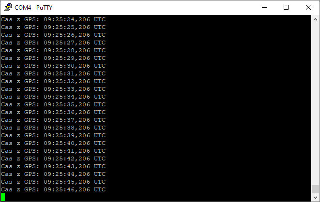
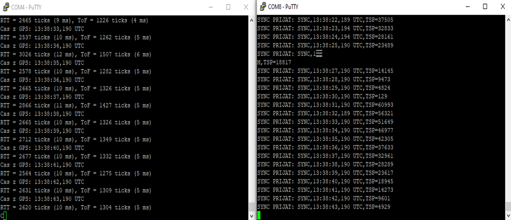

# Projekt do předmětu MPC-SSY

## Zadání projektu

Cílem bylo vytvořit funkční aplikaci zajišťující **časovou synchronizaci v síti**.  
Použit je **GPS přijímač** a čas získaný z něj (ve formátu NMEA zpráv).  
Časové údaje jsou dále přenášeny pomocí **protokolu LWM (Low-power Wireless Mesh)** mezi dvěma uzly v síti.  
Součástí je také **měření doby letu signálu (ToF)** pro korekci zpoždění při přenosu.

---

## 1. Parsování NMEA zpráv z GPS modulu

Prvním krokem bylo zajištění příjmu a zpracování dat z GPS.  
Z NMEA vět typu `$GPGGA`, `$GPRMC` je extrahováno UTC datum a čas.

- Komunikace probíhá přes **UART0** na rychlosti 9600 bps.
- Výstup (čas v UTC) je vypsán na **UART1** (38400 bps) pro ladění v terminálu.

### Ukázka výstupu (z terminálu master zařízení):

---

## 2. Synchronizace v síti pomocí LWM protokolu

Po získání času začne **Master** každou sekundu vysílat `SYNC` zprávu přes LWM.  
Ta obsahuje aktuální čas a interní časovou značku `TSP`.

**Slave zařízení** zprávu přijme a provede:

- změření času přijetí (`TRP`)
- krátké zpoždění a odeslání odpovědi `ACK` s časovou značkou `TSR`

Po přijetí `ACK` pak **Master** provede výpočet:

RTT  = TRF - TSP  
ToF  = (RTT - (TSR - TRP)) / 2

> Všechny časové značky jsou v jednotkách ticků časovače s frekvencí 250 kHz (prescaler 64).

Výstupní informace obsahují počítané hodnoty RTT a ToF v jednotkách ticků i milisekund.

### Ukázka funkce master-slave komunikace:

---

## Shrnutí funkcionality

- ✅ Parsování času z GPS (přes UART0)
- ✅ Výpis času do terminálu přes UART1
- ✅ Synchronizace dvou zařízení v síti pomocí LWM (NWK stack)
- ✅ Přesné měření časových značek: `TSP`, `TRP`, `TSR`, `TRF`
- ✅ Výpočet RTT a ToF v tickech i milisekundách
- ✅ Ošetření nevalidních dat a přetečení bufferu

---

## Použité platformy a technologie

- Platforma: **Atmel ATmega256RFR2 Xplained Pro**
- Jazyk: **C (AVR-GCC)**
- LWM stack: **NWK/PHY od Atmelu**
- Terminál: **PuTTY, 38400 bps**
- Komunikace: **UART, LWM (IEEE 802.15.4)**

---

> Projekt byl vypracován jako semestrální úloha pro kurz **MPC-SSY** (Bezdrátové senzorové sítě) na VUT FEKT.
